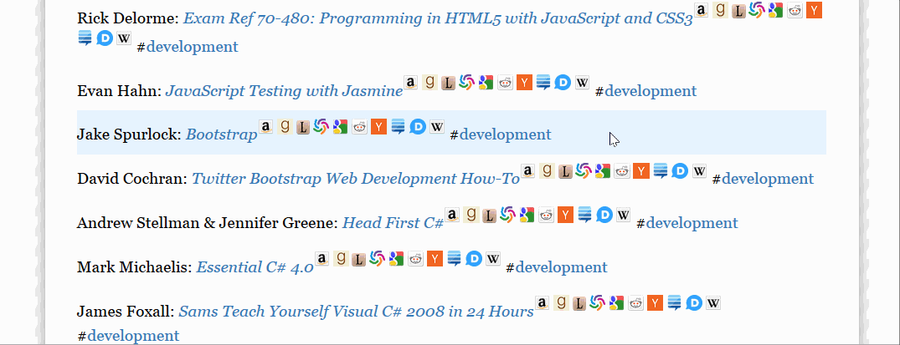

Reading list
============

A [pandoc](http://pandoc.org/) template for writing reading lists in
[Markdown](http://daringfireball.net/projects/markdown/syntax).

Description
-----------

Book entries are linkified with references to the local
[Calibre](http://calibre-ebook.com/) library, as well as
[Amazon.com](http://www.amazon.com/),
[Goodreads](http://www.goodreads.com/),
[LibraryThing](http://www.librarything.com/),
[WorldCat](http://www.worldcat.org/),
[Google Books](http://books.google.com/),
[Reddit](http://www.reddit.com/),
[Hacker News](http://news.ycombinator.com/),
[Stack Exchange](http://stackexchange.com/),
[Medium](http://medium.com/) and
[Wikipedia](http://en.wikipedia.org/wiki/Main_Page).

Furthermore, #hashtags may be used to group books into sub-lists.

Demo
----

Example
-------

Reading list in Markdown:

    - Matthew MacDonald: *HTML5: The Missing Manual* #development
    - ~~Erich Gamma & Richard Helm & Ralph Johnson & John Vlissides: *Design Patterns*~~ #development
    - Steve Krug: *Don't Make Me Think!* #design
    - Garr Reynolds: *Presentation Zen* #presentation

How it is rendered as HTML:

> **Development**
>
> -   Matthew MacDonald: *[HTML5: The Missing Manual](http://localhost:8080/browse/search?query=matthew%20macdonald%20html5%20the%20missing%20manual)* [[a](http://www.amazon.com/s/?field-keywords=matthew%20macdonald%20html5%20the%20missing%20manual)] [[g](http://www.goodreads.com/search?query=matthew%20macdonald%20html5%20the%20missing%20manual)] [[l](http://www.librarything.com/search.php?term=matthew%20macdonald%20html5%20the%20missing%20manual)] [[wc](http://www.worldcat.org/search?q=matthew%20macdonald%20html5%20the%20missing%20manual)] [[gb](http://www.google.com/?gws_rd=ssl#tbm=bks&q=matthew%20macdonald%20html5%20the%20missing%20manual)] [[r](http://www.google.com/#q=site:www.reddit.com+%22html5%3A%20the%20missing%20manual%22)] [[yc](http://www.google.com/#q=site:news.ycombinator.com+%22html5%3A%20the%20missing%20manual%22)] [[se](http://stackexchange.com/search?q=%22html5%3A%20the%20missing%20manual%22)] [[m](http://www.google.com/#q=site:medium.com+%22html5%3A%20the%20missing%20manual%22)] [[d](http://www.google.com/#q=forum+%22html5%3A%20the%20missing%20manual%22)] [[w](http://en.wikipedia.org/w/index.php?search=matthew%20macdonald%20html5%20the%20missing%20manual)]
> -   ~~Erich Gamma & Richard Helm & Ralph Johnson & John Vlissides: *[Design Patterns](http://localhost:8080/browse/search?query=erich%20gamma%20richard%20helm%20ralph%20johnson%20john%20vlissides%20design%20patterns)*~~ [[a](http://www.amazon.com/s/?field-keywords=erich%20gamma%20richard%20helm%20ralph%20johnson%20john%20vlissides%20design%20patterns)] [[g](http://www.goodreads.com/search?query=erich%20gamma%20richard%20helm%20ralph%20johnson%20john%20vlissides%20design%20patterns)] [[l](http://www.librarything.com/search.php?term=erich%20gamma%20richard%20helm%20ralph%20johnson%20john%20vlissides%20design%20patterns)] [[wc](http://www.worldcat.org/search?q=erich%20gamma%20richard%20helm%20ralph%20johnson%20john%20vlissides%20design%20patterns)] [[gb](http://www.google.com/?gws_rd=ssl#tbm=bks&q=erich%20gamma%20richard%20helm%20ralph%20johnson%20john%20vlissides%20design%20patterns)] [[r](http://www.google.com/#q=site:www.reddit.com+%22design%20patterns%22)] [[yc](http://www.google.com/#q=site:news.ycombinator.com+%22design%20patterns%22)] [[se](http://stackexchange.com/search?q=%22design%20patterns%22)] [[m](http://www.google.com/#q=site:medium.com+%22design%20patterns%22)] [[d](http://www.google.com/#q=forum+%22design%20patterns%22)] [[w](http://en.wikipedia.org/w/index.php?search=erich%20gamma%20richard%20helm%20ralph%20johnson%20john%20vlissides%20design%20patterns)]
>
> **Design**
>
> -   Steve Krug: *[Don't Make Me Think!](http://localhost:8080/browse/search?query=steve%20krug%20don%27t%20make%20me%20think%20)* [[a](http://www.amazon.com/s/?field-keywords=steve%20krug%20don%27t%20make%20me%20think%20)] [[g](http://www.goodreads.com/search?query=steve%20krug%20don%27t%20make%20me%20think%20)] [[l](http://www.librarything.com/search.php?term=steve%20krug%20don%27t%20make%20me%20think%20)] [[wc](http://www.worldcat.org/search?q=steve%20krug%20don%27t%20make%20me%20think%20)] [[gb](http://www.google.com/?gws_rd=ssl#tbm=bks&q=steve%20krug%20don%27t%20make%20me%20think%20)] [[r](http://www.google.com/#q=site:www.reddit.com+%22don%27t%20make%20me%20think!%22)] [[yc](http://www.google.com/#q=site:news.ycombinator.com+%22don%27t%20make%20me%20think!%22)] [[se](http://stackexchange.com/search?q=%22don%27t%20make%20me%20think!%22)] [[m](http://www.google.com/#q=site:medium.com+%22don%27t%20make%20me%20think!%22)] [[d](http://www.google.com/#q=forum+%22don%27t%20make%20me%20think!%22)] [[w](http://en.wikipedia.org/w/index.php?search=steve%20krug%20don%27t%20make%20me%20think%20)]
>
> **Presentation**
>
> -   Garr Reynolds: *[Presentation Zen](http://localhost:8080/browse/search?query=garr%20reynolds%20presentation%20zen)* [[a](http://www.amazon.com/s/?field-keywords=garr%20reynolds%20presentation%20zen)] [[g](http://www.goodreads.com/search?query=garr%20reynolds%20presentation%20zen)] [[l](http://www.librarything.com/search.php?term=garr%20reynolds%20presentation%20zen)] [[wc](http://www.worldcat.org/search?q=garr%20reynolds%20presentation%20zen)] [[gb](http://www.google.com/?gws_rd=ssl#tbm=bks&q=garr%20reynolds%20presentation%20zen)] [[r](http://www.google.com/#q=site:www.reddit.com+%22presentation%20zen%22)] [[yc](http://www.google.com/#q=site:news.ycombinator.com+%22presentation%20zen%22)] [[se](http://stackexchange.com/search?q=%22presentation%20zen%22)] [[m](http://www.google.com/#q=site:medium.com+%22presentation%20zen%22)] [[d](http://www.google.com/#q=forum+%22presentation%20zen%22)] [[w](http://en.wikipedia.org/w/index.php?search=garr%20reynolds%20presentation%20zen)]

Usage
-----

Edit `list.txt` in a text editor and add or remove book entries.

Then open `index.html` to view the result.

### Configuration

[Calibre](http://calibre-ebook.com/)'s web server should be configured
to run on port 8080 (see the variables `calibreHost` and `calibrePort`
in `custom.js`).

To do
-----

The linkification is implemented with a bit of jQuery in `custom.js`,
which is run by the browser. It might be faster to preprocess the HTML
document with [jsdom](http://www.2ality.com/2012/02/jsdom.html).

License
-------

[![License][license-image]][license-url]

Released under the MIT License. See the [LICENSE](LICENSE) file
for details.

[license-image]: https://img.shields.io/npm/l/markdownlint.svg
[license-url]: http://opensource.org/licenses/MIT

Alternatives
------------

Websites:

-   [Amazon.com: Your Lists](http://www.amazon.com/gp/lists/homepage.html)
-   [Goodreads Listopia](http://www.goodreads.com/list)
-   [LibraryThing Lists](http://www.librarything.com/lists)

Apps:

-   [Stacks](https://itunes.apple.com/us/app/stacks-a-modern-reading-list/id734184669)
-   [Reading List](https://itunes.apple.com/us/app/reading-list-keep-track-your/id1050466668)

Calibre plugins:

-   [Goodreads Sync](http://www.mobileread.com/forums/showthread.php?t=123281)
-   [Reading List](http://www.mobileread.com/forums/showthread.php?t=134856)
